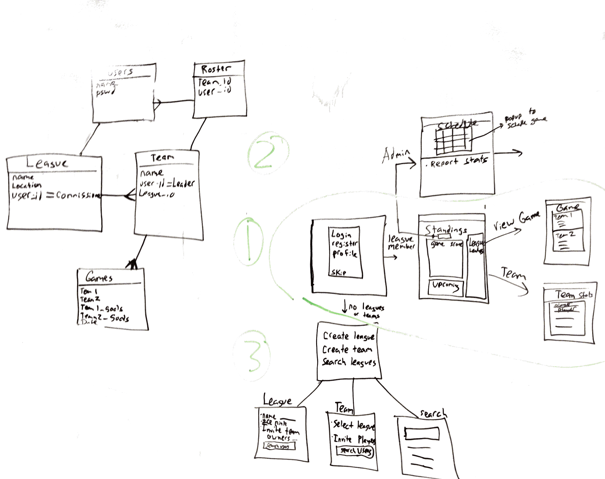

#Bush League

This is the back end repo for Bush League. 
The front end repo is located here: https://github.com/cwcrane/Bush-league-front

Bush league is an app for recreational sports teams to manage their league, team and players. It was designed first for hockey leagues, but the architecture of the app will allow for expansion into other sports down the line. Recreational sports need an app that will help with scheduling, stat tracking, payments to refs and team leaders, and just overall communication. 

##User Stories:

- As a user, I can create a league (you are admin if you do this)
- As a user, I can request or invite to join league
- As a user, I can create team (you are admin if you do this)
- request or invite to join team
- login/register
- As league admin, I can set up schedule: create games between any teams
- As team admin, I can report game results: Update game with goals for each team + player stats
- As a Player, I can view standings: each team’s wins + losses.
- As a player, I can view recent games.
- As a player, I can view upcoming games.
- As a player, I can view schedule.
- As a player, I can view a player's stats.

*Stretch features:*

- payment system
- facebook login
- League finder w/ map

##Database Tables:

- Sports- hockey
- locations
- Leagues
- teams
- seasons (join table)
- games
- players/users
- roster (join table)
- player stats

##Database Structure + Wireframe

Corrections to attached data model image:
1. Team has many leagues. Many-to-many. Season is the join table.
2. Stats table: game has many stats. stats has one game.